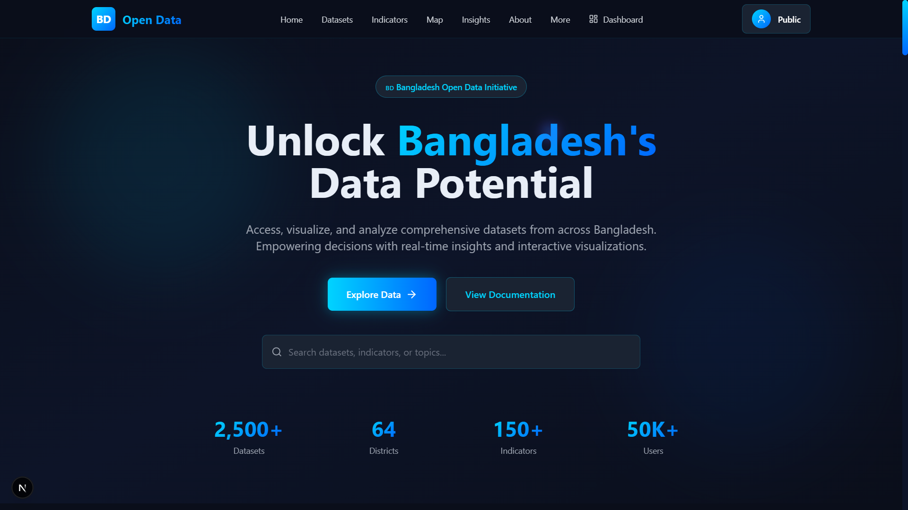
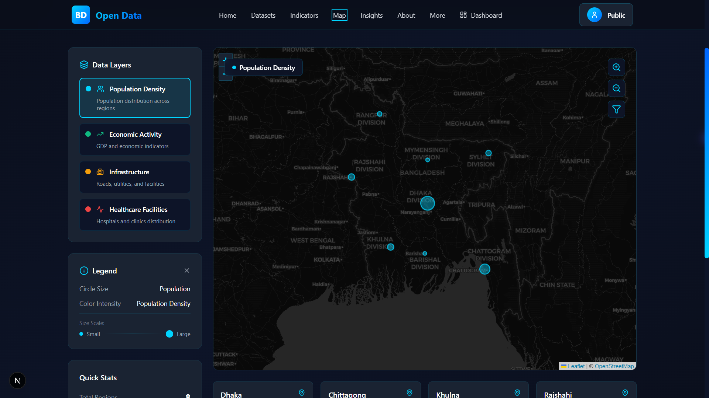
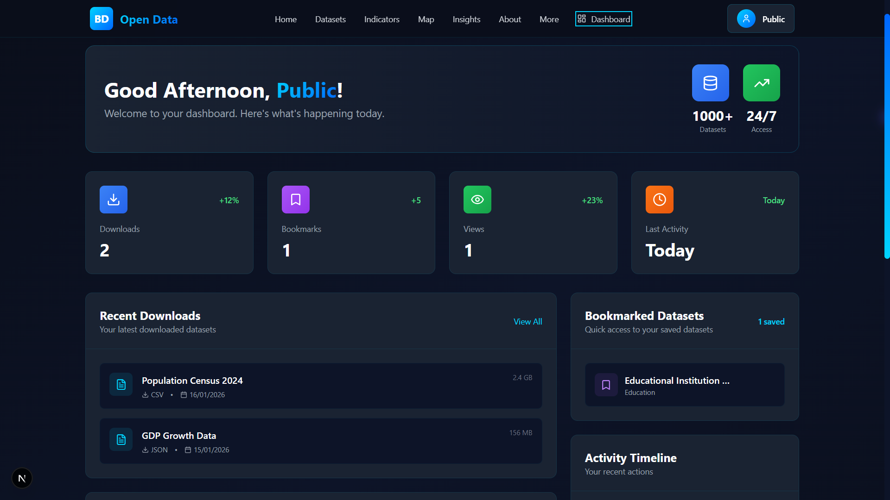

<div align="center">

<!-- Animated Header -->


<!-- Animated Badges -->
<p align="center">
  
  
  
  
  
</p>

<!-- Live Demo Button with Animation -->
<a href="https://job-task-woad.vercel.app/">
  
</a>

</div>

<br/>

<!-- Typing SVG -->
<p align="center">
  
</p>

---

## 📊 **Project Overview**

**BD Open Data Platform** is a comprehensive data management and visualization system designed to make Bangladesh's socio-economic data accessible to everyone. The platform enables users to explore datasets, visualize data through interactive maps and charts, and gain valuable insights into key indicators.

### ✨ **Key Highlights**

- 🗺️ **Interactive Geospatial Maps** - Visualize data across different divisions of Bangladesh
- 📈 **Real-time Analytics** - Dynamic charts and trend analysis
- 🔐 **Role-based Access Control** - Admin, Contributor, and Public user roles
- 📤 **Data Upload & Management** - Upload and manage datasets with ease
- 🎨 **Modern UI/UX** - Sleek, responsive design with glassmorphism effects
- 🔍 **Advanced Filtering** - Filter datasets by category, date, and region
- 📱 **Fully Responsive** - Optimized for desktop, tablet, and mobile

---

## 🚀 **Live Demo & Repository**

<div align="center">

| 🌐 **Live Application** | 📂 **GitHub Repository** |
|:---:|:---:|
| [https://job-task-woad.vercel.app/](https://job-task-woad.vercel.app/) | [github.com/AfsanaMim9639/job-task](https://github.com/AfsanaMim9639/job-task.git) |

</div>

---

## 🛠️ **Technology Stack**

<div align="center">

### Frontend


### Backend & Database


### Tools & Libraries


</div>

### 📦 **Key Dependencies**

```json
{
  "next": "^14.0.0",
  "react": "^18.0.0",
  "next-auth": "^4.24.0",
  "mongodb": "^6.3.0",
  "bcryptjs": "^2.4.3",
  "recharts": "^2.10.0",
  "react-leaflet": "^4.2.1",
  "lucide-react": "^0.300.0"
}
```

---

## ⚙️ **Setup & Installation**

### Prerequisites

- Node.js 18.0 or higher
- Git

### 📥 **Installation Steps**

```bash
# 1. Clone the repository
git clone https://github.com/AfsanaMim9639/job-task.git

# 2. Navigate to project directory
cd job-task

# 3. Install dependencies
npm install

# 4. Create .env.local file
touch .env.local
```

### 🔑 **Environment Variables**

Create a `.env.local` file in the root directory:

```env

# NextAuth Configuration
NEXTAUTH_SECRET=your_nextauth_secret_key
NEXTAUTH_URL=http://localhost:3000

# Google OAuth (Optional)
GOOGLE_CLIENT_ID=your_google_client_id
GOOGLE_CLIENT_SECRET=your_google_client_secret
```

### ▶️ **Run Development Server**

```bash
npm run dev
```

Open [http://localhost:3001](http://localhost:3001) in your browser.

### 🏗️ **Build for Production**

```bash
npm run build
npm start
```

---

## 🗺️ **Route Summary**

<details>
<summary><b>📍 Public Routes (No Authentication Required)</b></summary>

| Route | Description |
|-------|-------------|
| `/` | Homepage with hero section and features |
| `/datasets` | Browse and filter all datasets |
| `/indicators` | View key indicators and metrics |
| `/map` | Interactive geospatial data visualization |
| `/insights` | Data insights and analytics |
| `/about` | About the platform |
| `/api-docs` | API documentation |
| `/contact` | Contact form |
| `/login` | User authentication page |

</details>

<details>
<summary><b>🔐 Protected Routes (Authentication Required)</b></summary>

| Route | Access Level | Description |
|-------|--------------|-------------|
| `/dashboard` | All Users | Personal user dashboard |
| `/profile` | All Users | User profile management |
| `/settings` | All Users | Account settings |
| `/contributor-dashboard` | Contributor | Contributor-specific dashboard |
| `/upload` | Contributor/Admin | Upload and manage datasets |
| `/admin` | Admin Only | Admin dashboard with full controls |

</details>

<details>
<summary><b>🔌 API Routes</b></summary>

| Endpoint | Method | Description |
|----------|--------|-------------|
| `/api/auth/[...nextauth]` | GET/POST | NextAuth authentication |
| `/api/datasets` | GET | Fetch all datasets |
| `/api/datasets/[id]` | GET | Fetch single dataset |
| `/api/upload` | POST | Upload new dataset |
| `/api/indicators` | GET | Fetch key indicators |

</details>

---

##  **Implemented Features**

### 🎯 **Core Features**

<table>
<tr>
<td width="50%">

#### 🔐 **Authentication System**
-  Email/Password login
-  Google OAuth integration
-  Role-based access control (Admin, Contributor, Public)
-  Protected routes with middleware
-  Session management with NextAuth

</td>
<td width="50%">

#### 📊 **Data Management**
-  CSV/Excel file upload
-  Dataset categorization
-  Real-time data validation
-  Bulk data operations
-  Data versioning

</td>
</tr>
<tr>
<td width="50%">

#### 🗺️ **Interactive Visualizations**
-  Leaflet-based interactive maps
-  Division-level data visualization
-  Custom map markers and popups
-  Color-coded regions
-  Zoom and pan controls

</td>
<td width="50%">

#### 📈 **Analytics Dashboard**
-  Recharts integration for graphs
-  Line, Bar, and Pie charts
-  Trend analysis
-  Comparative statistics
-  Real-time data updates

</td>
</tr>
<tr>
<td width="50%">

#### 🔍 **Advanced Filtering**
-  Filter by category
-  Filter by date range
-  Filter by region/division
-  Search functionality
-  Sort options

</td>
<td width="50%">

#### 🎨 **Modern UI/UX**
-  Glassmorphism effects
-  Gradient backgrounds
-  Smooth animations
-  Custom cursor effects
-  Responsive design

</td>
</tr>
</table>

---

## 🎭 **Feature Deep Dive**

### 1️⃣ **Role-Based Access Control**

The platform implements a three-tier user system:

```javascript
👤 Public Users
   └─ View datasets
   └─ Explore maps
   └─ Access insights
   └─ Personal dashboard

📝 Contributors
   └─ All public features
   └─ Upload datasets
   └─ Manage own data
   └─ Contributor dashboard

🛡️ Admins
   └─ All contributor features
   └─ User management
   └─ Approve/reject datasets
   └─ Full system control
```

**How it works:**
- Users are assigned roles during registration or by admin
- Middleware checks user role before granting access to protected routes
- Role-based navigation menu dynamically shows relevant links
- Dashboard components render based on user permissions

---

### 2️⃣ **Interactive Geospatial Maps**

**Technology:** React Leaflet + OpenStreetMap

**Features:**
- Real-time data visualization across 8 divisions of Bangladesh
- Color-coded regions based on data values
- Custom popups showing detailed statistics
- Zoom controls and pan functionality
- Responsive map that adapts to screen size

**Implementation:**
```javascript
// Map displays data points with custom styling
<MapContainer center={[23.8103, 90.4125]} zoom={7}>
  <TileLayer url="https://{s}.tile.openstreetmap.org/{z}/{x}/{y}.png" />
  {divisions.map(division => (
    <Marker position={division.coordinates}>
      <Popup>{division.name}: {division.value}</Popup>
    </Marker>
  ))}
</MapContainer>
```

---

### 3️⃣ **Data Upload & Validation**

**Supported Formats:** CSV, XLSX, XLS

**Validation Process:**
1. File type verification
2. Data structure validation
3. Required fields check
4. Data type consistency
5. Duplicate detection

**Workflow:**
```
Upload File → Validate → Preview → Confirm → Save to Database
```

---

### 4️⃣ **Real-time Analytics Dashboard**

**Visualization Types:**
- 📊 Bar Charts - Compare values across categories
- 📈 Line Charts - Show trends over time
- 🥧 Pie Charts - Display proportional data
- 📉 Area Charts - Visualize cumulative data

**Dynamic Features:**
- Automatic chart generation from dataset
- Responsive charts that resize with screen
- Interactive tooltips on hover
- Customizable colors and themes

---

### 5️⃣ **Advanced Filtering System**

**Filter Options:**

| Filter Type | Options |
|-------------|---------|
| **Category** | Population, Economy, Education, Health, Environment |
| **Date Range** | Last 7 days, Last month, Last year, Custom range |
| **Division** | Dhaka, Chittagong, Rajshahi, Khulna, Barisal, Sylhet, Rangpur, Mymensingh |
| **Data Type** | Statistical, Geospatial, Time-series |

**Search Functionality:**
- Real-time search across dataset titles and descriptions
- Debounced input for performance
- Highlight matching terms

---

### 6️⃣ **Custom Cursor Effect**

**Visual Enhancement:**
- Smoky trail effect following cursor movement
- Gradient color animation
- Smooth particle fade-out
- Performance-optimized with requestAnimationFrame

**Technical Details:**
- React hooks for state management
- CSS animations for smooth transitions
- Conditional rendering (only on homepage)

---

## 🎨 **Design System**

### Color Palette

```
Primary: #00d4ff (Cyan Blue)
Secondary: #0066ff (Deep Blue)
Background: #0a0e1a (Dark Navy)
Card Background: #1a2332
Border: rgba(0, 212, 255, 0.1)
Text: #e8eef7
```

### Typography

- **Headings:** System fonts (San Francisco, Segoe UI, Roboto)
- **Body:** -apple-system font stack
- **Sizes:** Responsive scale from 0.875rem to 3rem

---

## 👥 **User Roles & Permissions**

<div align="center">

| Feature | Public User | Contributor | Admin |
|---------|:-----------:|:-----------:|:-----:|
| View Datasets | ✅ | ✅ | ✅ |
| Use Map | ✅ | ✅ | ✅ |
| View Insights | ✅ | ✅ | ✅ |
| Personal Dashboard | ✅ | ✅ | ✅ |
| Upload Data | ❌ | ✅ | ✅ |
| Edit Own Data | ❌ | ✅ | ✅ |
| Manage Users | ❌ | ❌ | ✅ |
| Approve Data | ❌ | ❌ | ✅ |
| System Settings | ❌ | ❌ | ✅ |

</div>

---

## 🧪 **Demo Credentials**

For testing purposes, use these demo accounts:

<table>
<tr>
<td align="center">
<br/>
<code>admin@bddata.com</code><br/>
<code>password123</code>
</td>
<td align="center">
<br/>
<code>contributor@bddata.com</code><br/>
<code>password123</code>
</td>
<td align="center">
<br/>
<code>user@bddata.com</code><br/>
<code>password123</code>
</td>
</tr>
</table>

---

## 📱 **Screenshots**

<div align="center">

### Homepage


### Interactive Map


### Dashboard


</div>

---

## 🤝 **Contributing**

Contributions are welcome! Please follow these steps:

1. Fork the repository
2. Create a feature branch (`git checkout -b feature/AmazingFeature`)
3. Commit your changes (`git commit -m 'Add some AmazingFeature'`)
4. Push to the branch (`git push origin feature/AmazingFeature`)
5. Open a Pull Request


---

## 👨‍💻 **Developer**

<div align="center">

**Afsana Mim**

[](https://github.com/AfsanaMim9639)
[](https://linkedin.com)
[](mailto:your.email@example.com)

</div>

---

## **Acknowledgments**

- [Next.js](https://nextjs.org/) - React Framework
- [Tailwind CSS](https://tailwindcss.com/) - CSS Framework
- [NextAuth.js](https://next-auth.js.org/) - Authentication
- [Leaflet](https://leafletjs.com/) - Interactive Maps
- [Recharts](https://recharts.org/) - Chart Library
- [Vercel](https://vercel.com/) - Deployment Platform

